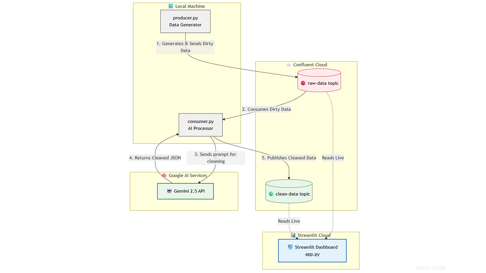

# Stream Refinery 🌊🧠


**"Garbage In, Gold Out"** — Real-time data cleaning and enrichment using Confluent and Google Vertex AI. This project was developed specifically for the [**AI Partner Catalyst: Accelerate Innovation**](https://devpost.com/software/stream-refinery) hackathon to demonstrate real-time data cleansing using GenAI.

## 📺 Demo Video
*(Will be added later.)*

## Project Goal
Standardize and fix "dirty" data streams (typos in locations, product names) on the fly using LLMs, transforming a chaotic raw stream into a high-quality analytical dataset without manual intervention.

## 🏗️ Architecture



> *Real-time pipeline: Confluent Cloud streams ➡️ Gemini AI cleaning ➡️ Streamlit Dashboard.*

1.  **Ingestion:** Python Producer generates mock transactions with intentional errors.
2.  **Transport:** Confluent Cloud (Kafka) streams the raw data to the `raw-data` topic.
3.  **Intelligence:** Google Vertex AI (Gemini) processes the JSON, fixes typos, and enriches the data.
4.  **Output:** Clean, validated data is produced back to the `clean-data` topic in real-time.
5.  **Visualization:** A Streamlit dashboard consumes both topics to display a live side-by-side comparison with a history stack.

## Setup

1.  Install dependencies:
    ```bash
    pip install -r requirements.txt
    ```

2.  Configure Environment:
    Create a `client.properties` file in the root directory. You need Confluent credentials and a Google AI Studio key:
    ```properties
    # Confluent Settings
    bootstrap.servers=YOUR_BOOTSTRAP_SERVER
    security.protocol=SASL_SSL
    sasl.mechanisms=PLAIN
    sasl.username=YOUR_KAFKA_API_KEY
    sasl.password=YOUR_KAFKA_API_SECRET

    # Google AI Settings
    google.api.key=YOUR_GOOGLE_AI_KEY
    ```

3.  Run the pipeline:
    
    **Terminal 1 (Data Source):**
    ```bash
    python producer.py
    ```

    **Terminal 2 (AI Processor):**
    ```bash
    python consumer.py
    ```

    **Terminal 3 (Live Dashboard):**
    ```bash
    streamlit run app.py
    ```

4.  **Verification:**
    Open your browser at `http://localhost:8501`. You will see the "Dirty" stream on the left and the AI-cleaned "Enriched" stream on the right appearing in real-time.

## 📄 License
This project is open-source and available under the [MIT License](LICENSE).